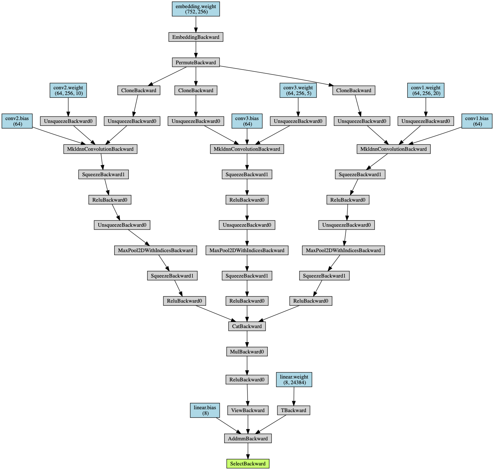
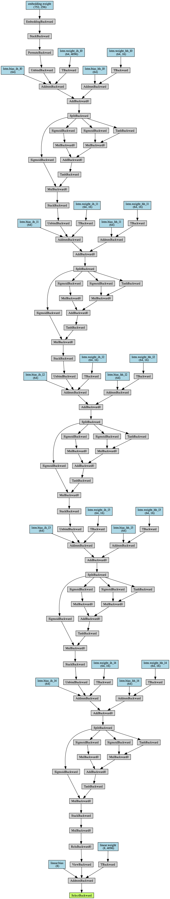

# 实验三 情感分析

陈嘉杰 2017011484 计72

## 实验目标

给定一个 2342 条文本带标注的数据集，需要将其归类到8个中类中，然后在一个 2228 条文本的测试集上进行验证，计算得到准确率、F-score和相关系数的指标。

## 实现内容

### 数据处理

要求对数据进行一定的处理，如 Bags-of-words、TF-IDF 和 word-embedding 。我采用的是直接把 Embedding 层放入到神经网络中一起训练，而没有去用已经训练好的 word embedding 的向量数据。

标签的表示方法上，我采用的是交叉熵，由于交叉熵需要对若干个样本一起进行计算，我把数据分为了很多个小块，每一块内计算一个交叉熵，合起来作为总共的 loss 函数。

### 实验环境

软件方面，这次使用的 Python 框架为 PyTorch ，额外使用了 sklearn 来计算 F-score，scipy来计算相关系数，用 torchviz 把网络进行可视化。版本如下：

```
torch==1.1.0
numpy==1.16.3
torchviz==0.0.1
scipy==1.1.0
```

Python 版本为 3.7.3 ，实验平台包括 macOS Mojave 和 Arch Linux 。在 Arch Linux 上使用的显卡为 Nvidia GTX 1080 。

代码执行命令：`python3 main.py [train] [test] [gpu]` ，常用的就是 `python3 main.py sinanews.train sinanews.test 0` 。

### 实验效果

在本次实验中，尝试了三个模型：CNN、RNN和MLP，并且都进行了测试，最后得到了相应的结果，包括在测试集中的准确率、F-score（micro，macro和weighted三种）、相关系数（每一组数据求相关系数后取平均）。各个模型得到的大致数据如下（取准确率最高时的数据）：


|      | 准确率 | F-score(macro) | F-score(micro) | F-score(weighted) | Cov  |
| ---- | ------ | -------------- | -------------- | ----------------- | ---- |
| CNN  | 55%    | 0.19           | 0.55           | 0.47              | 0.38 |
| RNN  | 57%    | 0.22           | 0.57           | 0.49              | 0.38 |
| MLP  | 46%    | 0.11           | 0.46           | 0.34              | 0.34 |

可以看到，虽然实现的各种网络都比较Naive，但还是能大致看出来，在我写的这几个模型里，从表现来看RNN>CNN>MLP。当然这并不绝对，可能换一个网络，同样是CNN可能表现的就会比我写的RNN要更好。

### 网络结构

#### CNN

设计了一个 embedding 配合卷积的网络，采用 `torchvia` 可视化后如图：



从 Embedding 的输出分出来三路的不同卷积的层，分别传入 MaxPool 后再通过全连接的层最后连到输出上。通过不同的卷积的 kernel size，期望得到不同的长度的特征，结合这些特征来学习出分类的结果。对应的代码如下：

```python
    def forward(self, x):
        x = self.embedding(x)
        x = x.permute(0, 2, 1)
        x1 = F.relu(self.conv1(x))
        x1 = F.relu(self.max1(x1))
        x2 = F.relu(self.conv2(x))
        x2 = F.relu(self.max2(x2))
        x3 = F.relu(self.conv3(x))
        x3 = F.relu(self.max3(x3))
        x = torch.cat([x1, x2, x3])
        x = F.relu(self.dropout(x))
        x = x.view(1, -1)
        x = self.linear(x)[0]
        return x
```

采用了 Xavier Initialization 来初始化各个结点的权值。

此处有图

训练过程中，也是可以看到CNN一开始很快就达到了 48% 的准确率，这是因为把所有的数据都分类到出现最多的一个分类了。接着，在很多个 epoch 过程中都没有走出这个分布，大概到20个 epoch的时候，开始走出这个困境，很快准确率就到到了峰值 55% ，之后就开始过拟合，数据集的准确率不断升高最后到 99.96% ，但测试集的准确率就慢慢回到了 48% 。这意味着 CNN 对数据的拟合能力是很好的，对数据集可以达到 99.96% 的准确率（只有1个错误），但也会出现过拟合的问题（可能与 dropout 系数的选取有关）。

#### RNN



RNN 直接采用了 PyTorch 提供的 LSTM 层，包含了 5 个 LSTM 单元，喂数据的时候也是一个一个词喂，将上一个词输出的隐藏数据传入到下一个词的输入，实现 RNN 的记忆功能，代码如下：

```python
    def forward(self, da):
        hidden = (torch.tensor(np.zeros((5, 256, 16)), dtype=torch.float).to(device), torch.tensor(np.zeros((5, 256, 16)), dtype=torch.float).to(device))
        for word in da:
            x = self.embedding(word)
            x = torch.stack([x])
            x = x.permute(0, 2, 1)
            x, hidden = self.lstm(x, hidden)
            x = F.relu(self.dropout(x))
            x = x.view(1, -1)
            x = self.linear(x)[0]
        return x
```

从训练的情况来看，也出现了和 CNN 类似的情况，到了 80 多个 epoch 的时候，测试集准确率到达了最高值 57% ，之后开始过拟合，准确率下降回到 55% 附近比 CNN 要比较好，这可能是比较高的 dropout 系数的结果。