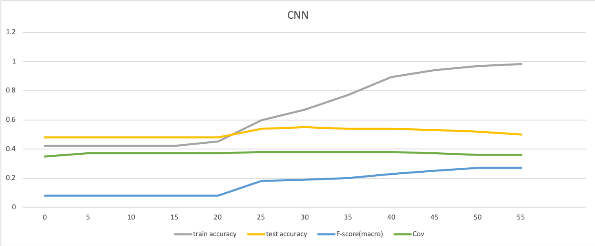
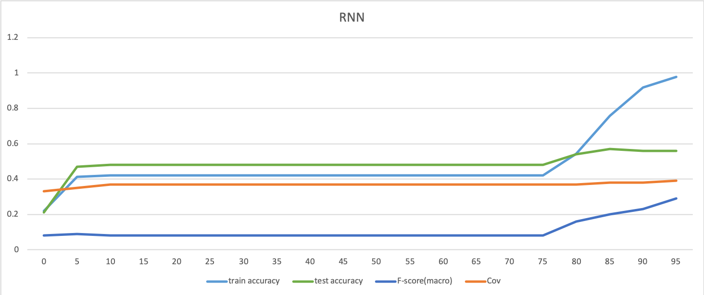
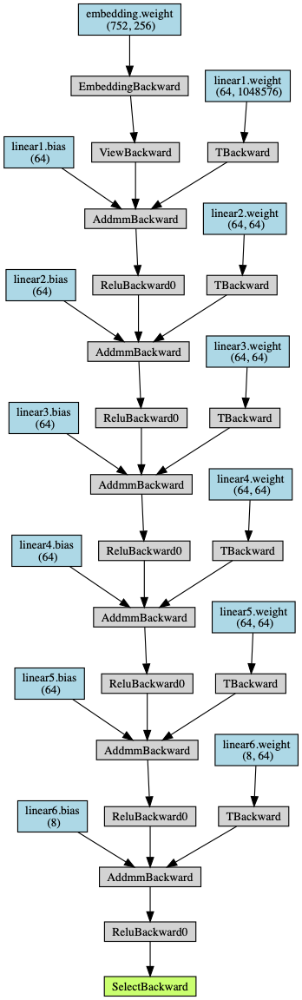
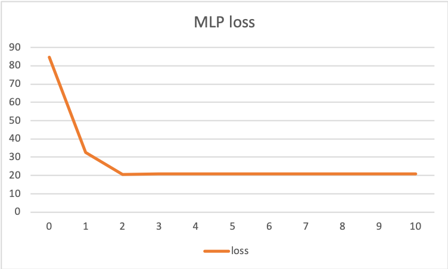

# 《人工智能导论》实验三

陈嘉杰 2017011484 计72

## 实验目标

给定一个 2342 条文本带标注的数据集，需要将其归类到8个中类中，然后在一个 2228 条文本的测试集上进行验证，计算得到准确率、F-score和相关系数的指标。

## 实现内容

### 数据处理

要求对数据进行一定的处理，如 Bags-of-words、TF-IDF 和 word-embedding 。我采用的是直接把 Embedding 层放入到神经网络中一起训练，而没有去用已经训练好的 word embedding 的向量数据。

标签的表示方法上，我采用的是交叉熵，由于交叉熵需要对若干个样本一起进行计算，我把数据分为了很多个小块，每一块内计算一个交叉熵，合起来作为总共的 loss 函数。

### 实验环境

软件方面，这次使用的 Python 框架为 PyTorch ，额外使用了 sklearn 来计算 F-score，scipy来计算相关系数，用 torchviz 把网络进行可视化。版本如下：

```
torch==1.1.0
numpy==1.16.3
torchviz==0.0.1
scipy==1.1.0
```

Python 版本为 3.7.3 ，实验平台包括 macOS Mojave 和 Arch Linux 。在 Arch Linux 上使用的显卡为 Nvidia GTX 1080 。

代码执行命令：`python3 main.py [train] [test] [gpu]` ，常用的就是 `python3 main.py sinanews.train sinanews.test 0` 。

代码会输出每个 epoch 相应的情况，一个例子如下：

```
epoch 0 loss 84.796
train correct/all: 179/2342, dist: [416, 124, 145, 984, 367, 180, 99, 27] [7, 0, 0, 0, 0, 2335, 0, 0]
test correct/all: 175/2228=0.08
test f-score: macro: 0.02 micro: 0.08 weighted: 0.01, cov: 0.11
```

它代表了，当前 epoch 结束后，loss 为 84.796 ，在训练集上，在2342条数据中正确了179个，右边的第一个数组表示实际上的标签分布，第二个数组表示预测的标签分布。

下面则是在测试集上得到的正确率、三种F-score的值和相关系数。

### 实验效果

在本次实验中，尝试了三个模型：CNN、RNN和MLP，并且都进行了测试，最后得到了相应的结果，包括在测试集中的准确率、F-score（micro，macro和weighted三种）、相关系数（每一组数据求相关系数后取平均）。各个模型得到的大致数据如下（取准确率最高时的数据）：


|      | 准确率 | F-score(macro) | F-score(micro) | F-score(weighted) | Cov  |
| ---- | ------ | -------------- | -------------- | ----------------- | ---- |
| CNN  | 55%    | 0.19           | 0.55           | 0.47              | 0.38 |
| RNN  | 57%    | 0.22           | 0.57           | 0.49              | 0.38 |
| MLP  | 46%    | 0.11           | 0.46           | 0.34              | 0.34 |

可以看到，虽然实现的各种网络都比较Naive，但还是能大致看出来，在我写的这几个模型里，从表现来看RNN>CNN>MLP。当然这并不绝对，可能换一个网络，同样是CNN可能表现的就会比我写的RNN要更好。

### 流程分析

对于不同的网络结构，主要的流程都是一致的：

1. 读入数据，包括训练集和测试集，进行预处理，把单词转换为数字
2. 建立神经网络，设置好各种参数
3. 不断对整个训练集进行循环，把训练集切分为很多个 batch ，在每个 batch 中，喂数据，获得 loss 函数，然后进行梯度下降。
4. 每个 epoch 结束后，计算当前模型在训练集和测试集上的效果。

### 网络结构

#### CNN

设计了一个 embedding 配合卷积的网络，采用 `torchvia` 可视化后如图：


从 Embedding 的输出分出来三路的不同卷积的层，分别传入 MaxPool 后再通过全连接的层最后连到输出上。通过不同的卷积的 kernel size，期望得到不同的长度的特征，结合这些特征来学习出分类的结果。对应的代码如下：

```python
    def forward(self, x):
        x = self.embedding(x)
        x = x.permute(0, 2, 1)
        x1 = F.relu(self.conv1(x))
        x1 = F.relu(self.max1(x1))
        x2 = F.relu(self.conv2(x))
        x2 = F.relu(self.max2(x2))
        x3 = F.relu(self.conv3(x))
        x3 = F.relu(self.max3(x3))
        x = torch.cat([x1, x2, x3])
        x = F.relu(self.dropout(x))
        x = x.view(1, -1)
        x = self.linear(x)[0]
        return x
```

采用了 Xavier Initialization 来初始化各个结点的权值。



训练过程中，也是可以看到 CNN 一开始很快就达到了 48% 的准确率，这是因为把所有的数据都分类到出现最多的一个分类了。接着，在很多个 epoch 过程中都没有走出这个分布，大概到20个 epoch的时候，开始走出这个困境，很快准确率就到到了峰值 55% ，之后就开始过拟合，数据集的准确率不断升高最后到接近 100% ，但测试集的准确率就下降。这意味着 CNN 对数据的拟合能力是很好的，对数据集可以达到接近 100% 的准确率（只有1个错误），但也会出现过拟合的问题（可能与 dropout 系数的选取有关）。

我在这里采用的是“并行”的卷积核的形式的网络，另外很常见的也有“串行”的卷积核，即卷积、MaxPool后再卷积、MaxPool。我也进行了类似的测试，但是并没有得到很好的效果，所以最后还是选取了上面这个网络。

#### RNN


RNN 直接采用了 PyTorch 提供的 LSTM 层，包含了 5 个 LSTM 单元，喂数据的时候也是一个一个词喂，将上一个词输出的隐藏数据传入到下一个词的输入，实现 RNN 的记忆功能，代码如下：

```python
    def forward(self, da):
        hidden = (torch.tensor(np.zeros((5, 256, 16)), dtype=torch.float).to(device), torch.tensor(np.zeros((5, 256, 16)), dtype=torch.float).to(device))
        for word in da:
            x = self.embedding(word)
            x = torch.stack([x])
            x = x.permute(0, 2, 1)
            x, hidden = self.lstm(x, hidden)
            x = F.relu(self.dropout(x))
            x = x.view(1, -1)
            x = self.linear(x)[0]
        return x
```



从训练的情况来看，也出现了和 CNN 类似的情况，到了 80 多个 epoch 的时候，测试集准确率到达了最高值 57% ，之后开始过拟合，准确率下降回到 55% 附近，比 CNN 要好一些，这可能是比较高的 dropout 系数的结果。

#### MLP



MLP就是比较粗暴地，把多个全连接的层直接串起来，然后输出。比较可惜的是，MLP似乎并没有达到想要的效果，loss 函数一直没有往下降，准确率也不是很高，可能和MLP的层数不足、MLP每层的大小不够大有关。代码如下：

```python
    def forward(self, x):
        x = self.embedding(x).view(1, -1)
        x = F.relu(self.linear1(x))
        x = F.relu(self.linear2(x))
        x = F.relu(self.linear3(x))
        x = F.relu(self.linear4(x))
        x = F.relu(self.linear5(x))
        x = F.relu(self.linear6(x))[0]
        return x
```



从第三个 epoch 开始，loss funcion就未能继续往下降低了，但测试集的正确率只有 15% ，各种指标也非常差（F-score: 0.3(macro),0.15(micro),0.04(weighted), Cov: 0.28），说明这个 MLP 模型并不能拟合出这个数据，可能是它层数不够多、每一层的大小不够大导致的。

### 结果分析

从上面的一系列实验结果来看，RNN>CNN>MLP，但并不能宏观地说明这三种网络结构的好坏，因为它们的效果都和自己的结构有很大的关系。但也能够看出一些规律来：

1. MLP 需要比较多的隐藏层才能保证比较好的拟合性能，但随着层数增加，训练的时间也会更长，占用的显卡资源也会更多
2. 添加一层 dropout 系数比较高的层有助于防止过拟合
3. 在这个例子中，CNN 比 RNN 收敛要更快，需要更少的 epoch 

### 问题思考

1. 实验训练什么时候停止是合适的？在代码中，使用固定迭代次数实现的，同时人盯着输出的各个参数来决定是否提前终止。这当然是比较原始的方法，比较好的方法可能有，如果若干个 epoch loss 变化很小，或者是准确率等指标不再变化甚至开始下降的时候，停止训练。固定迭代次数的好处是简单，只要开够次数就可以得到想要的结果，后期人看一眼图就知道情况了。如果采用自动判断的一些方法，可能会提早结束一次训练，因为有时候训练就会出现中间一段时间卡着不动，若干个 epoch 后突然变好的情况。我一开始训练的时候总发现，很快就训练进入了前面提到的“只输出一个分类”的情况，正确率是百分之四十多，然后维持好一些 epoch ，我以为是我的网络结构写错了，一直很苦恼不知道怎么让它跑出来。有一次，我就让它再跑了几个 epoch 后，忽然发现它自己就走出来了，就如上面网络结构分析里的图一样，现在看起来卡住了不动，后面可能还会突然有提升的。
2. 在这次实验中，实验参数的初始化主要用的的 Xavier Initialization 方法，常见的还有零均值初始化，高斯分布初始化和正交初始化等等。我认为，这更多取决于网络的结构和一些经验，所谓的 Best Practise ，比如人们会说，对于ReLU适合什么初始化比较好，tanh又应该什么初始化比较好，纯粹就是实践的时候比较出来的，好像也没有太多的理由在里面。神经网络很大的一个问题就是可解释性的问题，这里就是一个例子。
3. 过拟合是深度学习常见的问题，解决过拟合的一个方法，我在前面也提到过，就是添加一个 dropout 层，系数不能太小，可以达到一定的效果。另外一种可能的做法是，把神经网络上的一些参数也放到 loss function中，一方面让输出结果和标注的结果尽量接近，另一方面让系数不要过大。或者不断地重新切分数据集和验证集，防止网络拟合在数据的特定部分上。也可以“见好就收”，准确率足够了就不要继续往下训练了。这更多还是经验之谈。
4. CNN、RNN和MLP相比较之下，CNN适合局部性比较强的输入，比如图片和文本，它会把相邻的像素或者文字提取出一些比较有用的信息来进行训练；RNN好处是前面的所有输入都会影响到当前的输出，对于一些有上下文的输入，比如翻译、语音识别这种场景比较有优势；MLP就纯粹是暴力，叠层数强行拟合，很简单粗暴，基本没有什么能够理解的东西。优点的对面就是缺点，除了有优势的这些输入，剩下的情况可能就不适合 CNN 和 RNN 的结构来实现，需要其他针对特定情况设计的网络结构了。缺乏可解释性是各种神经网络的缺点。

## 心得体会

两年前大一秋季学期的时候，就看到过网上讲神经网络的博客，自己就动手写了一个简单的[计算图](https://github.com/jiegec/nn)，可以拟合出 a ^ b 这个很简单确又必须需要隐藏层参与的一个神经网络。当时神经网络给我的印象就是，自己动手写一个能用的好像并不难，计算图上的计算也是很经典的微积分和线性代数的知识，虽然写得很粗暴，没有为了性能去写矩阵的运算，但确实是可以工作的。但也给我很不好的印象，就是，即使是 xor 这么简单的一个工作，有时候随机出来的初始值就是训练不出来 xor ，也没法解释为什么，增加层数也不能保证一定可以训练出来，总之就比较的玄学，之后就没有碰过神经网络。

这次作为人工智能导论的作业，又一次捡起了神经网络。这两年，深度学习很火热，各方也是各种讨论，众说纷纭。我一直的观点就是，在神经网络得到比较好的解释前，我是不会把它放到生产上的。这次做这个作业，玄学果不其然又一次出现在了我网络结构的调整上。我不希望计算机变成这样一个乏味的过程，在一个我无法理解的黑盒子上左敲一下右打一下，期望能够得到一些比较好的结果。虽然这次实验来看效果还行，但我仍然感觉不到乐趣。